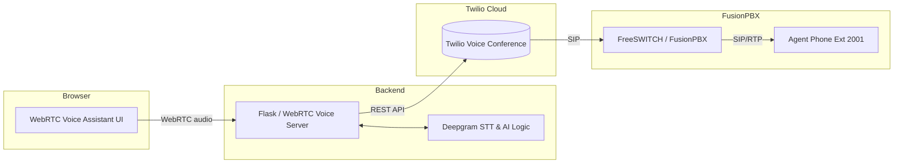
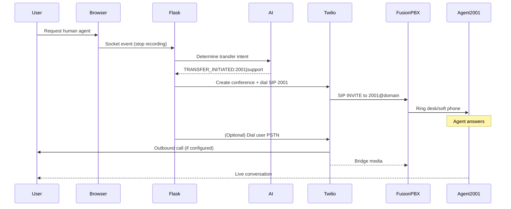
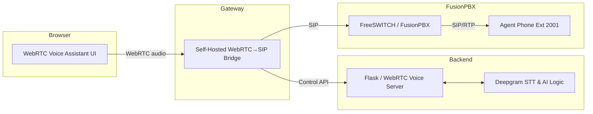
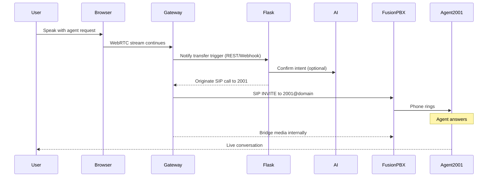
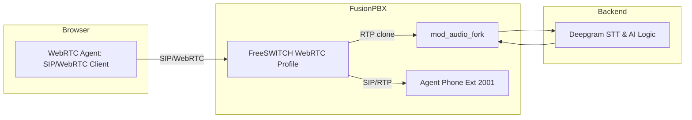
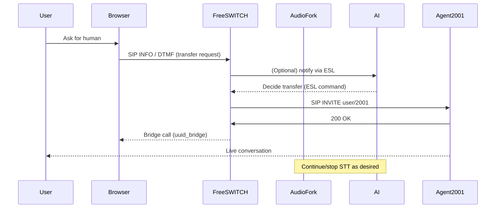

# WebRTC Voice Assistant → FusionPBX Transfer Options

This document compares three integration patterns for handing off a WebRTC voice assistant session to a human agent on FusionPBX extension **2001**. Each option highlights the required components, an architecture diagram, and the step-by-step call flow from the voice AI to the live agent.

---

## Option 1 — Twilio-Managed Bridge (Current Implementation)

Leverage Twilio Programmable Voice as a hosted WebRTC→SIP bridge. The assistant decides to transfer, and the backend asks Twilio to originate both the agent leg and (optionally) the user leg into a Twilio-hosted conference.

### Architecture

### Transfer Flow

### When to Choose
- Need a working handoff quickly—minimal infrastructure changes.
- Comfortable relying on Twilio for elasticity, logging, and SIP delivery.
- OK with the assistant’s audio staying in Python / Deepgram (Twilio only bridges the final call).

### Pros & Cons
| ✅ Pros | ⚠️ Cons |
| --- | --- |
| Fast to implement (hours). | Requires Twilio credentials and billing. |
| No change to existing Deepgram stack. | Adds an external dependency and extra conference hop. |
| Detailed call analytics in Twilio console. | User audio is duplicated if you also call their PSTN phone. |

---

## Option 2 — Self-Hosted WebRTC→SIP Gateway

Replace Twilio with a self-managed media gateway (e.g., FreeSWITCH `mod_signalwire`, Asterisk ARI, Janus + SIP plugin). This gateway accepts the assistant’s WebRTC session and produces SIP legs toward FusionPBX.

### Architecture

### Transfer Flow

### When to Choose
- Want to remove Twilio but keep media off of FusionPBX/Flask.
- Prepared to operate a high-availability media gateway (certs, TURN, scaling).
- OK investing significant engineering time (days) to match Twilio’s reliability.

### Pros & Cons
| ✅ Pros | ⚠️ Cons |
| --- | --- |
| Eliminates Twilio costs & dependency. | Must build/maintain the gateway infrastructure. |
| Full control over media handling & logging. | Requires WebRTC + SIP expertise (TLS, SRTP, TURN). |
| Can run close to FusionPBX for lower latency. | Adds another moving part compared to Option 3. |

---

## Option 3 — Native FreeSWITCH WebRTC Termination

Register the browser directly to FusionPBX/FreeSWITCH as a WebRTC endpoint. The assistant’s AI pipeline consumes a copy of the RTP stream (e.g., via `mod_audio_fork`), while FreeSWITCH owns both the user and agent call legs.

### Architecture

### Transfer Flow

### When to Choose
- Long-term architecture: FreeSWITCH manages all media and transfers natively.
- You’re ready to configure WebRTC on FusionPBX (certs, TURN, SRTP).
- You can adapt the AI pipeline to consume audio from `mod_audio_fork` and push TTS back via ESL.

### Pros & Cons
| ✅ Pros | ⚠️ Cons |
| --- | --- |
| Simplest runtime path once completed—no external bridges. | Requires major refactor (3–5+ days). |
| Native FreeSWITCH control (BLFs, queues, analytics). | Need audio fork infrastructure for Deepgram + AI. |
| Easier to add more PBX features later. | Must expose FusionPBX WebRTC securely on the public internet. |

---

## Summary Comparison

| Scenario | Option 1: Twilio | Option 2: Self-Hosted Gateway | Option 3: Native FreeSWITCH |
| --- | --- | --- | --- |
| **Time to deliver** | Hours | Days | Multiple days / refactor |
| **Recurring cost** | Twilio usage fees | Infrastructure/ops | Minimal (FS resources) |
| **Control over media** | Twilio-managed | High | Full |
| **Integration effort** | Low | Medium–High | High |
| **Works with existing Deepgram pipeline** | Yes | Needs gateway integration | Requires audio fork setup |

Today’s demo environment uses **Option 1**, which keeps the Deepgram-driven voice assistant intact while Twilio handles the live transfer to **extension 2001**.

